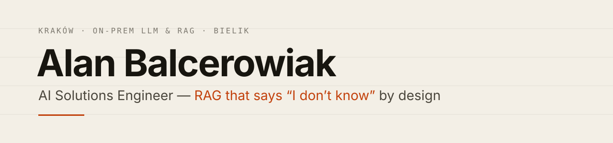
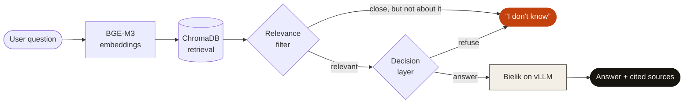

<picture>
  <source media="(prefers-color-scheme: dark)" srcset="assets/banner-dark.svg">
  
</picture>

<h3>I build RAG that says <i>“I don't know”</i> — enforced by architecture, not by the prompt.</h3>

On-premise LLM systems on the Polish model <b>Bielik</b> · company data never leaves its own infrastructure · Kraków, Poland

---

## 🧭 At a glance

| | Details |
|---|---|
| **Role** | AI Solutions Engineer — architecture to production for on-premise LLM products |
| **Focus** | Private RAG on company documents · tool-calling assistants · voice AI · AI for security |
| **Signature idea** | *“I don't know”* as a first-class answer: relevance filter + decision layer **before** the model is called |
| **Second track** | AI-augmented security research with direct, responsible disclosure |
| **Studying** | Cybersecurity, Andrzej Frycz Modrzewski Kraków University (2025–2028) |
| **Certified** | Generative AI with Large Language Models — DeepLearning.AI × AWS (2026) |
| **Based in** | Kraków, Poland · 🇵🇱 Polish · 🇬🇧 English · 🇩🇪 German (basic) |

---

## 📊 In numbers

<table align="center">
<tr>
<td align="center" width="20%"> <b>100%</b> on-premise</td>
<td align="center" width="20%"> <b>5</b> solution areas</td>
<td align="center" width="20%"> <b>14</b> web products shipped solo</td>
<td align="center" width="20%"> <b>5</b> vulnerabilities reported &amp; patched</td>
<td align="center" width="20%"> <b>0</b> data sent to third-party clouds</td>
</tr>
</table>

---

## 🧠 RAG that refuses

> “Answer only from the context” works in roughly **80%** of cases. The other 20% is a hallucination that lands in the company Slack as a screenshot. So the decision *answer vs. refuse* is made **before** the LLM ever sees the question.

**How I measure it:** regression tests — out of 100 questions *outside* the knowledge base, how many end in a refusal.

---

## 🛠️ What I work on

| Area | Approach | Typical stack |
|---|---|---|
| **On-prem RAG** | Grounded answers with cited sources; refusal enforced by architecture | Bielik · vLLM · BGE-M3 · ChromaDB · FastAPI |
| **Tool-calling assistants** | The model answers from tool results, not memory; read-only enforced by design | Bielik · tool calling · Python · FastAPI |
| **AI for network security** | Deterministic configuration analysis, explained by an LLM in plain language | Python · static analysis · Bielik |
| **Brand-style image generation** | LoRA fine-tuning, tenant isolation, access control | Python · LoRA · RBAC · multi-tenancy |
| **Voice assistants** | Speech → model → speech in one pipeline, nothing leaves the box | Whisper · Bielik · Piper · vLLM |

---

## 🧰 Tech stack

**Models & serving**

**Retrieval & data**

**Apps, APIs & infra**

**Security**

---

## 🔐 AI-augmented security research

I test web applications with AI in the loop and report findings **directly** to the teams that own them — no bug-bounty middlemen. So far: **5 vulnerabilities** reported in one application, including **one critical**; the team paid a bounty and **all were patched**.

---

## 🧭 How I work

1. **I use the tool myself first** — every day, on real data — before it reaches a client.
2. **“I don't know” is a valid answer.** Better to refuse once than to lie once.
3. **The best technology is the one the user never has to think about.**

---

**Need a private AI assistant that runs on your own hardware and knows when to say “I don't know”?**

🇵🇱 Inżynier Rozwiązań AI z Krakowa — więcej po polsku na <a href="https://alanbalcerowiak.pl">alanbalcerowiak.pl</a>

